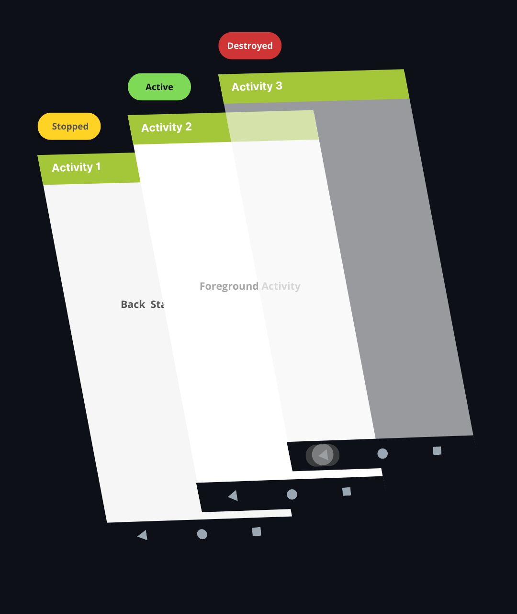

# Fundamentos de uma Aplicação

Os aplicativos Android podem ser desenvolvidos usando as linguagens [Kotlin](https://github.com/VictorSantos12/Kotlin), [Java]() e C++. As ferramentas do Android SDK compilam seu código junto com quaisquer dados e arquivos de recursos em um APK ou Android App Bundle.

Um package Android, que é um arquivo compactado com um sufixo `.apk`, contém o conteúdo de um aplicativo Android necessário em tempo de execução e é o arquivo que os dispositivos com tecnologia Android usam para instalar o aplicativo.

Um Android App Bundle, que pode ser identificado por um arquivo com o sufixo `.aab`, contém o conteúdo de um projeto de aplicativo Android, incluindo alguns metadados adicionais que não são necessários em tempo de execução.

Um AAB é um formato de publicação e não pode ser instalado em dispositivos Android. Ele adia a geração e a assinatura do APK para um estágio posterior. Ao distribuir seu aplicativo por meio do Google Play, por exemplo, os servidores do Google Play geram APKs otimizados que contêm apenas os recursos e o código exigidos por um determinado dispositivo que está solicitando a instalação do aplicativo.

Cada aplicativo Android vive em sua própria sendBox, protegida pelos seguintes recursos de segurança:

- O sistema operacional Android é um sistema Linux multiusuário no qual cada aplicativo é um usuário diferente. 

- Por padrão, o sistema atribui a cada aplicativo um ID de usuário Linux exclusivo (o ID é usado apenas pelo sistema e é desconhecido para o aplicativo). O sistema define permissões para todos os arquivos em um aplicativo para que apenas o ID do usuário atribuído a esse aplicativo possa acessá-los. 

- Cada processo tem sua própria máquina virtual (VM), portanto, o código de um aplicativo é executado isoladamente de outros aplicativos. 

- Por padrão, cada aplicativo é executado em seu próprio processo Linux. O sistema Android inicia o processo quando qualquer um dos componentes do aplicativo precisa ser executado e, em seguida, encerra o processo quando não é mais necessário ou quando o sistema deve recuperar memória para outros aplicativos.

Também cabe ressaltar que o sistema Android implementa o princípio de privilégio mínimo. Ou seja, cada aplicativo, por padrão, tem acesso apenas aos componentes necessários para fazer seu trabalho e nada mais. Isso cria um ambiente seguro no qual um aplicativo não pode acessar partes do sistema para as quais não tem permissão. No entanto, existem maneiras de um aplicativo compartilhar dados com outros aplicativos e de um aplicativo acessar os serviços do sistema:

- É possível fazer com que dois aplicativos compartilhem o mesmo ID de usuário do Linux e, nesse caso, eles podem acessar os arquivos um do outro. Para conservar os recursos do sistema, os aplicativos com o mesmo ID de usuário também podem ser executados no mesmo processo do Linux e compartilhar a mesma VM. Os aplicativos também devem ser assinados com o mesmo certificado. 

- Um aplicativo pode solicitar permissão para acessar dados do dispositivo, como localização, câmera e conexão Bluetooth. O usuário deve conceder explicitamente essas permissões.

Tais métodos serão mais bem abordados no decorrer da documentação.

# Componentes

Os App Components são os blocos de construção essenciais de um aplicativo Android. Cada componente é um ponto de entrada pelo qual o sistema ou um usuário pode entrar em seu aplicativo. Há quatro tipos distintos de app components:

- Activities 
- Services 
- Broadcast receivers 
- Content providers

Cada component serve a um propósito distinto e possui um ciclo de vida distinto, o qual define como o mesmo é criado e destruído. Os tópicos a seguir descrevem cada um dos quatro em detalhes:

# Activities

Uma <i>activity</i> é um entry point da aplicação com qual o usuário pode interagir. Um aplicativo poder conter uma ou várias activities, as quis possuiem certa independência dentro da estrutura da aplicação.

Toda activity é subclasse de [Activity](https://developer.android.com/reference/android/app/Activity?authuser=1), e dela derivam os seguintes conceitos:

## a) Fragments

A

## b) Activity Lifecycle

As atividades em um sistema Android são agrupadas seguindo o modelo de [Stacks](https://developer.android.com/guide/components/activities/tasks-and-back-stack?authuser=1), sendo posicionadas de acorde com sua ordem de abertura em uma <i>task (conjunto de atividades)</i>. Quando uma atividade é inicializada, esta é posicionada sobre a stack atual, passando a estar em execução:

Desse modo, a atividade anterior sempre permanece abaixo na stack, compondo a <i>back stack</i>. Uma atividade que faz parte da back stack não retorna ao primeiro plano até que a nova atividade seja encerrada.

A tela inicial do dispositivo é o ponto de partida para a maioria das tasks. Quando um aplicativo é acessado, sua task fica em primeiro plano. Se não existir nenhuma task para o aplicativo (o aplicativo não foi usado recentemente), uma nova task será criada a partir da tela inicial do app.

As atividades na stack nunca são reorganizadas, apenas sofrem push quando acessadas, ou pop, quando retiradas da pilha caso uma interação do usuário com o Back button ou gesture seja detectada. Quando uma atividade é encerrada, sua antecedente se torna ativa, e o estado anterior da interface é retomado.

A classe Activity se encarrega de criar métodos para lidar com as diferentes formas de interação com o usuário e seus resultados. Tais métodos definem o ciclo de vida de uma atividade:

    public class Activity extends ApplicationContext {

        protected void onCreate(Bundle savedInstanceState);

        protected void onStart();

        protected void onRestart();

        protected void onResume();

        protected void onPause();

        protected void onStop();

        protected void onDestroy();
    }

<!-- O ciclo de vida de uma atividade é essencialmente composto por quatro estados: -->

<!--
### Active

Caso uma atividade esteja em primeiro plano (na posição mais acima da stack atual), seu estado é definido como <i>active</i> ou <i>running</i>, sendo esta a atividade com a qual o usuário está interegindo.

### Visible

Caso uma atividade tenha perdido o foco, mas ainda esteja sendo apresentada ao usuário, seu estado é definido como <i>visible</i>. Alguns exemplos deste caso são: quando uma nova atividade cujo espaço não equivalha a totalidade da tela é acessada (dialog ou popUp); quando uma outra atividade se posiciona acima na stack; ou a atividade em si não é focalizável na janela atual. Esse estado mantém a atividade completamente ativa, mantendo todas as informações anexadas ao gerenciador de janelas.

### Stopped

Se uma atividade for completamente obscurecida por outra, o estado desta passa a ser <i>stopped</i> ou <i>hidden</i>. Ela ainda retém todas as informações, no entanto, não é mais visível, logo, sua janela fica oculta e geralmente será eliminada pelo sistema quando a memória for necessária em outro lugar

### Destroyed

O sistema pode descartar uma atividade da memória pedindo que ela termine ou simplesmente eliminando seu processo, a tornando <i>destroyed</i>. Quando for exibida novamente para o usuário, ela deve ser completamente reiniciada, retomando o estado anterior. -->

O diagrama a seguir ilustra como o ciclo de vida de uma atividade deve se comportar:

  

Dentro do ciclo de vida de uma tela, é importante ficar atento as inicializações e finalizações de cada periodo:

> [!NOTE]
>
> O ciclo completo acontece entre a primeira chamada do método onCreate() e a primeira chamada do onDestroy(). Uma atividade fará toda a configuração do estado "global" em onCreate(), liberando todos os recursos restantes em onDestroy().
>
> O tempo de vida visível de uma atividade acontece entre a chamada do método onStart() e uma chamada correspondente ao método onStop(). Durante este periodo o usuário pode ver a atividade na tela, embora não esteja em primeiro plano. Ambos os métodos podem ser chamados várias vezes à medida que a atividade se torna visível e oculta para o usuário.
>
> O tempo de vida em primeiro plano de uma atividade acontece entre a chamada do método onResume() e uma chamada correspondente ao método onPause(). Durante este periodo a atividade fica visível, ativa e interagindo com o usuário. Uma atividade pode frequentemente ficar entre os estados resumed e paused - por exemplo, quando o dispositivo entra em suspensão, quando um resultado de atividade é entregue, quando uma nova intenção é entregue - portanto, o código nesses métodos deve ser bastante leve.

# Services

Um service é um entry point capaz de executar um recurso de uma aplicação em segundo plano enquanto o usuário não interage com ela, ou de disponibilizar estes recursos a outras aplicações.

Serviços podem ser tanto iniciados (restritos aos próprios processos) quanto vinculados (se estendem a processos de outros apps), de modo que se tornam úteis para todos os tipos de conceitos de sistemas high-level.

Todo service é subclasse da classe Service

# Broadcast receivers

Um broadcast receiver é um componente de comunicação tanto entre usuário e sistema, quanto entre aplicações. Sua função é basicamente disparar e transmitir eventos a quem interessar, independentemente se o app destino esteja ou não em uso.

Um app android utiliza um BroadcastReceiver tanto quando gera notificações para o usuário na barra de status, quanto quando sinaliza a outros apps que informações nele geradas estão disponíveis para uso (downloads, imagens, etc), o que ocorre sem que o usuário tome conhecimento.

Todo broadcast receiver é subclasse da classe BroadcastReceiver

# Content providers

Um content provider gerencia um conjunto compartilhado de dados do app que você pode armazenar no sistema de arquivos, em um banco de dados SQLite, na Web ou em qualquer outro local de armazenamento permanente que seu app possa acessar. Por meio do provedor de conteúdo, outros apps podem consultar ou modificar os dados, se este assim permitir.

Por exemplo, o sistema Android oferece um provedor de conteúdo que gerencia os dados de contato do usuário. Qualquer app com as permissões adequadas pode consultar o provedor de conteúdo, por exemplo, usando ContactsContract.Data, para ler e gravar informações sobre uma pessoa específica.

Todo content provider é subclasse da classe ContentProvider.
